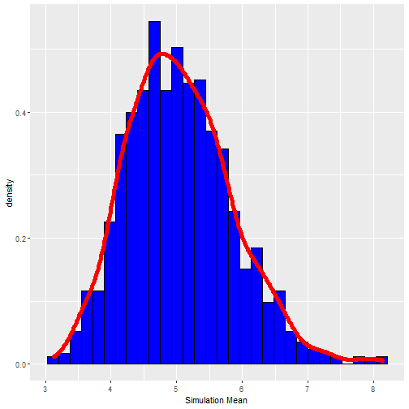
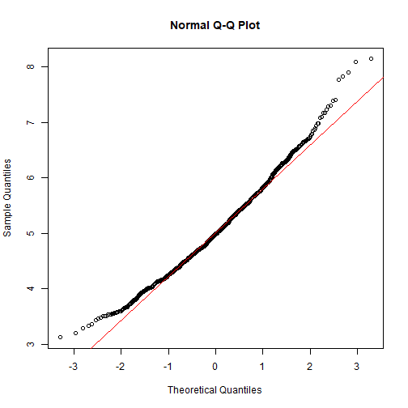

# Simulation excercise

## Description

In this project  the exponential distribution is investigated in R and it is compared with the Central Limit Theorem. The exponential distribution is simulated in R with rexp(n, lambda) where lambda is the rate parameter. The mean of exponential distribution is 1/lambda and the standard deviation is also 1/lambda. Set lambda = 0.2 for all of the simulations. It's investigated the distribution of averages of 40 exponentials.


### Loading Libraries

The libraries needed are loaded

```r
library("ggplot2")
```

### Parameter definition

Reproducible seed is created. The lambda parameter(), the sample size (n), number of simulationes (simulations) and the exponential distribution data (df) are created as well. Then the means for each row are calculated and saved in means_df

```r
set.seed(10)
lambda <- 0.2
n <- 40
simulations <- 1000
df <- replicate(simulations, rexp(n, lambda))
means_df <- apply(df, 2, mean)
```

## Distribution center
The simulated data center (centers) and theoretical center (centert) are calculated.

```r
centert<-1/lambda
centers<-mean(means_df)
cat(sprintf("\"%f\" \"%f\"\n", centert, centers))
```

```
## "5.000000" "5.045060"
```
The results show that the center distribution of the data is around 5 (theoretical=5; simulated=5.04). With the simuated value really close to the theoretical value.

## Variance of the distribution
The simulated data variance (variances) and theoretical variance (variancet) are calculated.

```r
variancet<-1/(lambda^2*n)
variances<-var(means_df)
cat(sprintf("\"%f\" \"%f\"\n", variancet, variances))
```

```
## "0.625000" "0.637254"
```
The results show that the variance of the data is around 0.625 (theoretical=0.625; simulated=0.637). With the simuated value really close to the theoretical value as well.

## Normal distribution
With the values calculated before, the distribution of the data is shown

```r
data<-data.frame(means_df)
hist<-ggplot(data, aes(x=means_df))+ xlab("Simulation Mean")
hist<-hist + geom_histogram(aes(y=..density..), color="black", fill="blue") 
hist<-hist + geom_density(color = "red", size=2)
hist
```

```
## `stat_bin()` using `bins = 30`. Pick better value with `binwidth`.
```



Due to the Central Limit Theorem (CLT), the distribution of averages of 40 exponentials is very close to a normal distribution.


## Coverage for confidence interval (95% Confidence Interval)
Theoretical interval:

```r
ti <- centert + c(-1,1)*1.96*sqrt(variancet)/sqrt(n)
ti
```

```
## [1] 4.755 5.245
```
Data interval:

```r
di <- centers + c(-1,1)*1.96*sqrt(variances)/sqrt(n)
di
```

```
## [1] 4.797669 5.292450
```

Comparison of the distribution of averages of 40 samples with the normal distributios

```r
# compare the distribution of averages of 40 exponentials to a normal distribution
qqnorm(means_df)
qqline(means_df, col = 2)
```




