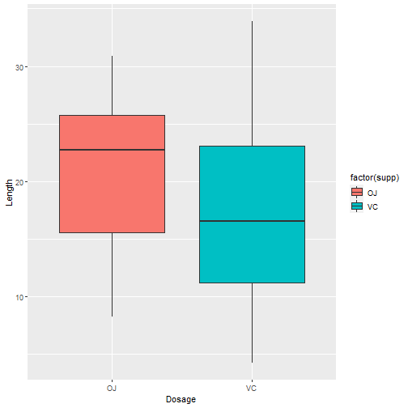
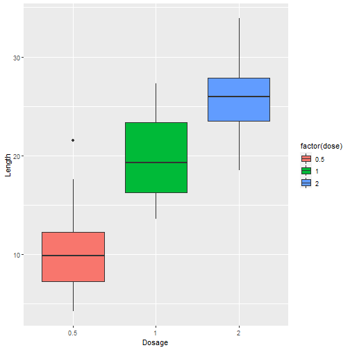

### Description 

The data is extracted from R dataset package "Tooth Growth".
In the second part of the project, is provided an analysis and summary of the data. Also, confidence intervals and hypothesis test are used to compare tooth growth by Supp and Dose.

### Loading Libraries and data
The libraries and data needed are loaded

```r
library(ggplot2)
data(ToothGrowth)
```

### Summary of the data

Summary of "ToothGrowth"

```r
summary(ToothGrowth)
```

```
##       len        supp         dose      
##  Min.   : 4.20   OJ:30   Min.   :0.500  
##  1st Qu.:13.07   VC:30   1st Qu.:0.500  
##  Median :19.25           Median :1.000  
##  Mean   :18.81           Mean   :1.167  
##  3rd Qu.:25.27           3rd Qu.:2.000  
##  Max.   :33.90           Max.   :2.000
```

A first look of the data from ToothGrowth

```r
head(ToothGrowth)
```

```
##    len supp dose
## 1  4.2   VC  0.5
## 2 11.5   VC  0.5
## 3  7.3   VC  0.5
## 4  5.8   VC  0.5
## 5  6.4   VC  0.5
## 6 10.0   VC  0.5
```

The columns "supp" and "dose" are tabled in order to see the types of supplements and dosages in the data "ToothGrowth".

```r
table(ToothGrowth$supp) # Supplement
```

```
## 
## OJ VC 
## 30 30
```

```r
table(ToothGrowth$dose) # Dosage
```

```
## 
## 0.5   1   2 
##  20  20  20
```

### Correlation
We can see how variables are related to each other with the correlation. In here, what we are trying to do see what variable are directly influencing the length.


```r
cor(ToothGrowth[sapply(ToothGrowth, is.numeric)])
```

```
##            len      dose
## len  1.0000000 0.8026913
## dose 0.8026913 1.0000000
```
As we see, the length is extremely related to the dosage column. Also to the supplement type, but the correlation is higher for the dosage.


### Supplement type

We start with a boxplot of the supplement type, to see how the range of values is

```r
bx1 <- ggplot(ToothGrowth, aes(x =factor(supp), y = len, fill = factor(supp)))
bx1 + geom_boxplot() + xlab("Dosage") + ylab("Length")
```


  We can see that most of the values for the OJ supplement are higher than the VC ones. Another fact is the variability of VC is greater than the OJ ones.
  
### Dosage quantity

We perform the same analysis for the miligrams/day dosage.

```r
bx2 <- ggplot(ToothGrowth, aes(x =factor(dose), y = len, fill = factor(dose)))
bx2 + geom_boxplot() + xlab("Dosage") + ylab("Length")
```



As we expected from the correlation, as we we increase the dosage the length is greater.


### Confidence intervals

We calculate the range of the 95% interval for tooth length (len column).

```r
confInter <- (mean(ToothGrowth$len) + c(-1, 1) * qnorm(0.975) * sd(ToothGrowth$len)/sqrt(length(ToothGrowth$len)))
confInter
```

```
## [1] 16.87783 20.74884
```

### Supplement T Test

We use a t-test for the realtion between the tooth length and the supplement type

```r
t.test(len~supp, data=ToothGrowth)
```

```
## 
## 	Welch Two Sample t-test
## 
## data:  len by supp
## t = 1.9153, df = 55.309, p-value = 0.06063
## alternative hypothesis: true difference in means is not equal to 0
## 95 percent confidence interval:
##  -0.1710156  7.5710156
## sample estimates:
## mean in group OJ mean in group VC 
##         20.66333         16.96333
```
The T-Test shows that we cannot reject the Null hypothesis.

### Dosage T Test

Before we make the analysis a subset of the data is made for every dosage.

```r
dos1 <- subset(ToothGrowth, dose == 0.5)
dos2 <- subset(ToothGrowth, dose == 1)
dos3 <- subset(ToothGrowth, dose == 2)
```

T-Test

```r
t.test(len~supp, data=dos1) 
```

```
## 
## 	Welch Two Sample t-test
## 
## data:  len by supp
## t = 3.1697, df = 14.969, p-value = 0.006359
## alternative hypothesis: true difference in means is not equal to 0
## 95 percent confidence interval:
##  1.719057 8.780943
## sample estimates:
## mean in group OJ mean in group VC 
##            13.23             7.98
```

```r
t.test(len~supp, data=dos2) 
```

```
## 
## 	Welch Two Sample t-test
## 
## data:  len by supp
## t = 4.0328, df = 15.358, p-value = 0.001038
## alternative hypothesis: true difference in means is not equal to 0
## 95 percent confidence interval:
##  2.802148 9.057852
## sample estimates:
## mean in group OJ mean in group VC 
##            22.70            16.77
```

```r
t.test(len~supp, data=dos3) 
```

```
## 
## 	Welch Two Sample t-test
## 
## data:  len by supp
## t = -0.046136, df = 14.04, p-value = 0.9639
## alternative hypothesis: true difference in means is not equal to 0
## 95 percent confidence interval:
##  -3.79807  3.63807
## sample estimates:
## mean in group OJ mean in group VC 
##            26.06            26.14
```

In the tests we see that we can reject the null hypothesis for 0.5 and 1 miligrams/day dosages (small p-values). In the other hand, we cannot reject the null hypothesis for 2 miligrams/day dosage.

### Conclusions

- The tooth growth is controlled mainly by the dosage of supplements. The only dosages studied are 0.5, 1, 2 miligrams/day. We saw that the length increases as the dosage does.
- The supplement type is not the main reason for the growth, but the OJ supplement is less variable and shows slightly better tooth length. The VC has more variable results.
- For dosages of 0.5 and 1 miligram/day, the OJ has a higher effect on the length of tooth than the VC.
- For a dosage of 2 miligrams/day, there are so such difference between OJ and VC supplements.
